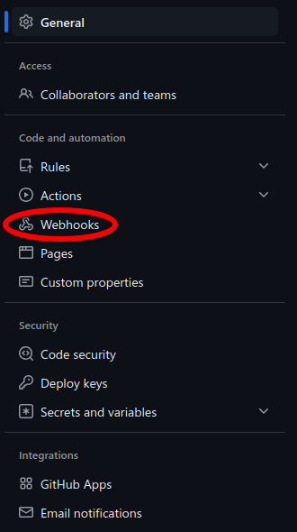
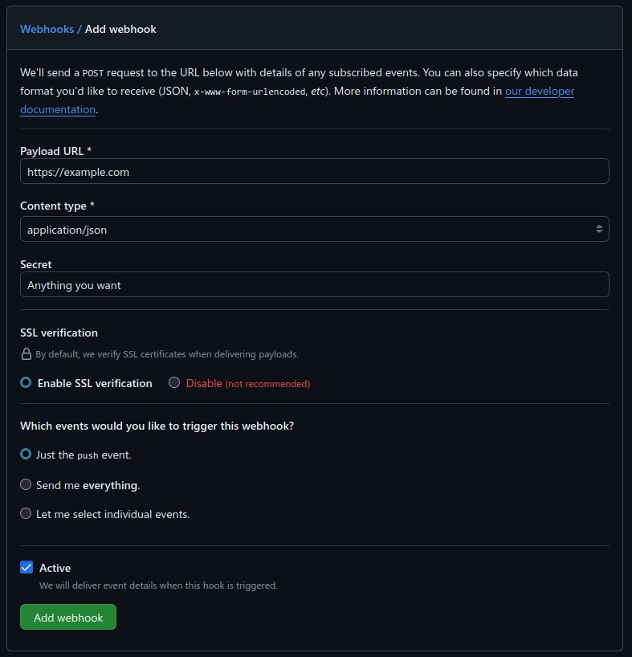

# PyGitHook
A simple python app for automatic git pulls with GitHub Webhooks

## Setup
To use PyGitHook, first create a webhook in your repository settings. It will be under the tab named "Webhooks"



Your payload URL should be the URL you're exposing PyGitHook on. If you're just exposing it as http with no reverse proxy, simply put it as `http://[SERVER IP]:5500`. The content type **must** be set to `application/json`.
Make the secret anything you want, but remember it as it will be needed later!



After you've created a webhook on GitHub, log into your server and clone your repository to any folder (remember which one because it will be needed).

Once your repository is cloned, run the following command to install PyGitHook automatically:

```bash
bash -c "$(curl -L https://raw.githubusercontent.com/Benrogo-Dev/PyGitHook/main/install.sh)"
```
